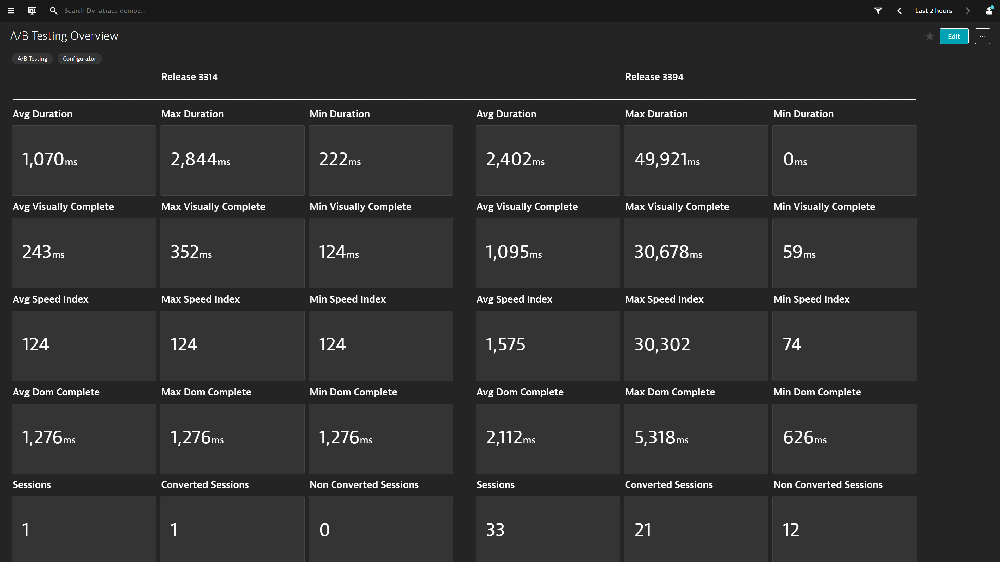

## A/B Testing Dashboard
This dashboard pack provides an comparison of KPIs based on session property filters.

# Prerequisites Highlights

1. Define a session property that captures A/B (i.e. CSS Selector, values="ReleaseA","ReleaseB").
