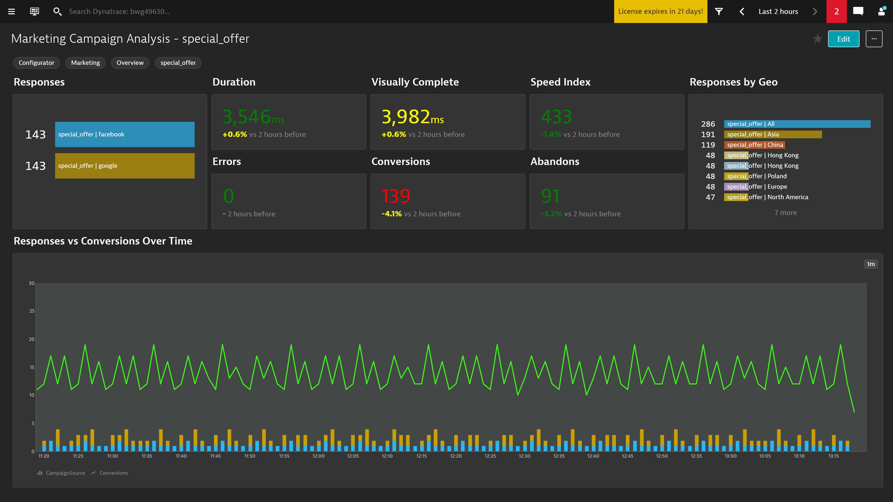

[Requires Google Chrome PowerUp Plugin](https://chrome.google.com/webstore/detail/dynatrace-dashboard-power/dmpgdhbpdodhddciokonbahhbpaalmco)

# BizOps Marketing Campaign Analysis Dashboard

This dashboard pack provides a detail analysis for your marketing campaigns. You can see the responses broken down  
by a specific campain, campaign responses by GEO and key KPI data like revenue and conversion for the campaigns.  
Fully explain what a campaign/source is...

# Prerequisites Highlights

1. Create a session property for your campaign (i.e. Web property pack - web\_utm\_campaign query string)
image
2. Create a session property for your campaign source (i.e. Web property pack - web\_utm\_source query string)
3. Create a metric for the campaign session property (Metric: Useraction Duration split by Campaign/Geo)
4. Create a metric for the campaign source session property (Metric: Useraction Duration split by Source/Geo)
5. Create a metric for the campaign and source (Metric: Useraction Duration split by Campaign/Source)
6. Create a metric for the source and campaign (Metric: Useraction Duration split by Source/Campaign)
7. Mark the last user action step as a key user action for the user journey
