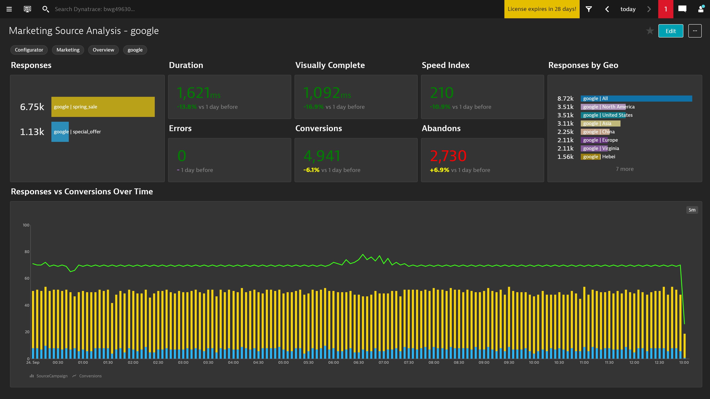

# BizOps Marketing Source Analysis Dashboard

This dashboard pack provides a detail analysis for your marketing campaigns. You can see the responses broken down  
by a specific campain, campaign responses by GEO and key KPI data like duration and conversion for the campaigns.  

# Prerequisites Highlights

1. Create a session property for your campaign (i.e. Web property pack - web\_utm\_campaign query string)
2. Create a session property for your campaign source (i.e. Web property pack - web\_utm\_source query string)
3. Create a metric for the campaign source session property (Metric: Useraction Duration split by Source/Geo)
4. Create a metric for the source and campaign (Metric: Useraction Duration split by Source/Campaign)
5. Create a conversion goal(s) for user actions that indicate a converted user session (i.e. Order Confirmation)
6. Create a milestone goal(s) for user actions that indicate the start of a potential converted session (i.e. Add to Cart)

[Requires Google Chrome PowerUp Plugin](https://chrome.google.com/webstore/detail/dynatrace-dashboard-power/dmpgdhbpdodhddciokonbahhbpaalmco)
