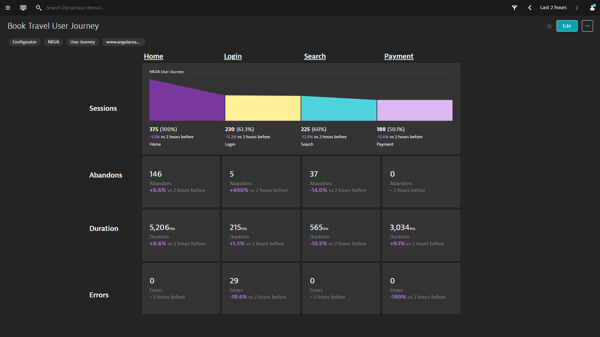

## BizOps User Journey Dashboard
This dashboard pack provides a quick overview of your user journey with a focus on conversion count, abandon count, duration and errors for each user journey step. Each step header is a drill down link to a dashboard the compares sessions that continued vs sessions that exited for each user journey step. Drill down from the last journey step will take you to a Conversion Analysis dashboard. If you haven't defined key user actions or cannot define them, in the user journey creation screen, edit the funnel query and enter a string like this (example is for a 4 step user journey): ((useraction.application="EasyTravel" and useraction.name="Home")) AS "Awareness", ((useraction.application="EasyTravel" and useraction.name="Login")) AS "Interest", ((useraction.application="EasyTravel" and useraction.name="Review")) AS "Evaluation", ((useraction.application="EasyTravel" and useraction.name="Purchase")) AS "Decision".

[Usage Video Coming Soon]()
