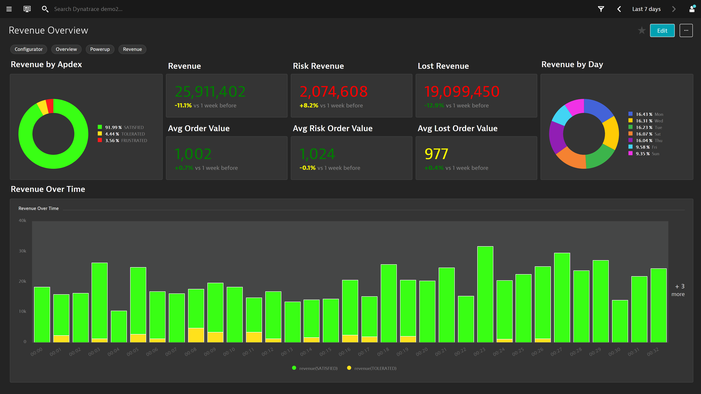

## Revenue Overview Dashboard
This dashboard pack provides an overview of revenue generated by your application.

## Prereqs
1. Create a revenue session property (i.e. CSS Selector).
2. Create a conversion goal on a user action that verifies a converted user journey.

[Requires Google Chrome PowerUp Plugin](https://chrome.google.com/webstore/detail/dynatrace-dashboard-power/dmpgdhbpdodhddciokonbahhbpaalmco)
