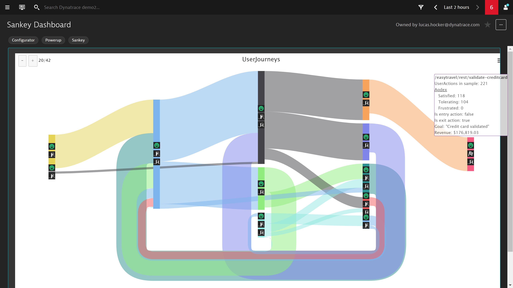

## Sankey Dashboard
This dashboard pack provides a Sankey diagram. Sankey diagrams are a specific type of flow diagram that is used for visualization of User Journeys. The tooltip includes User Journey metadata like Apdex, Entry/Exit Actions, Goals and Revenue.

