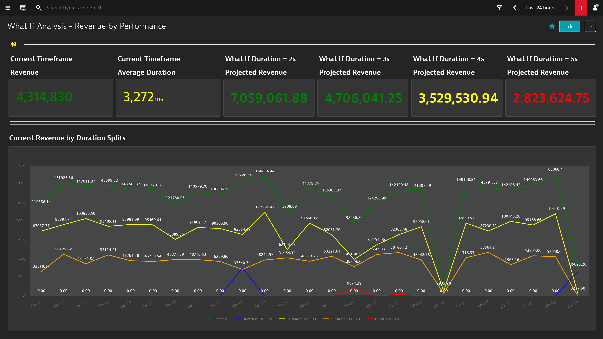

## BizOps What If Analysis - Revenue by Preformance Dashboard
This dashboard pack provides what if analysis for revenue based on duration.

# Prerequisites Highlights

1. Create a conversion goal(s) for user actions that indicate a converted user session (i.e. Order Confirmation)
2. Create a session property (i.e. CSS Selector) for your application revenue value (i.e. Revenue)
